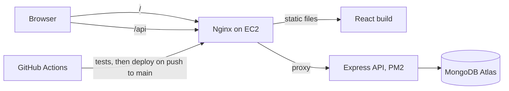

# Bello! Language Exchange Platform

A full-stack web app that connects people who want to practise each other's languages. A Thai speaker learning English is matched with an English speaker learning Thai. They can follow each other, post, comment and chat.

Built as a solo project: React frontend, Express and MongoDB backend, deployed to AWS EC2 through a GitHub Actions pipeline.

A feature showcase page is in [`docs/index.html`](docs/index.html). It can be served with GitHub Pages from the `docs/` folder.

<!-- TODO: add 2 or 3 screenshots or a short GIF here (feed, profile, chat, admin). -->
<!-- TODO: add the live URL here if the EC2 instance is running. -->

## Features

**For learners**
- Three-step registration that builds the language profile: native language, languages being learned with CEFR levels (A1 to C2), interests and bio
- Partner matching: finds people whose native language is one you are learning and who are learning yours
- Search for people by name or language
- Feed with language filter and search, posts with topics, likes and comments
- Follow and unfollow, with follower counts
- Direct messages with a conversation list and unread counts (the chat refreshes every 5 seconds)
- Profile page with a map of the user's city (OpenStreetMap)
- Post translation from English to Thai (MyMemory API)

**For administrators**
- User management: search, edit, suspend and unsuspend, promote to admin
- Post moderation: remove any post
- Reports: users can report a post or a person, admins can list and resolve reports through the API

**Not finished**
- The tag management screen is a UI prototype. Tags are not saved to the database yet.
- Social sign-in buttons are part of the design but are not connected to a provider.
- Image and voice note fields exist in the data model. There is no upload feature yet.

## Design

The screens were designed in Figma before they were built: [Language Exchange design file](https://www.figma.com/design/MRxutelQ8RnLTygvLTyd7t/Language-Exchange).

## Tech stack

| Layer | Technology |
| --- | --- |
| Frontend | React 18, Vite, React Router 7, Tailwind CSS 4, Axios, Leaflet |
| Backend | Node.js 22, Express 5, Mongoose 9, JWT, bcryptjs, Helmet, express-rate-limit |
| Database | MongoDB (Atlas in production) |
| Tests | Jest and Supertest against a real MongoDB |
| DevOps | GitHub Actions, AWS EC2, Nginx, PM2 |

## Architecture



The frontend and the API are served from the same address. The browser calls `/api/...`, so no host name or IP address is stored in the code.

The backend follows an MVC layout: `routes` map URLs to `controllers`, controllers use Mongoose `models`, and `middleware` handles authentication, admin checks, id validation and errors.

## Getting started

You need Node.js 20 or newer and a MongoDB database (a free Atlas cluster or a local server).

```bash
git clone https://github.com/Preeyaries/language_exchange_platform.git
cd language_exchange_platform
```

**Backend**

```bash
cd backend
npm install
cp .env.example .env     # then edit .env
npm run dev              # http://localhost:5000
```

| Variable | Purpose |
| --- | --- |
| `MONGODB_URI` | MongoDB connection string |
| `JWT_SECRET` | Long random string used to sign login tokens |
| `PORT` | API port, default 5000 |
| `CLIENT_URL` | Optional. Comma-separated origins allowed by CORS |

**Frontend**

```bash
cd frontend
npm install
npm run dev              # http://localhost:5173
```

The dev server forwards `/api` to `http://localhost:5000`.

**First admin account**

Register a normal account in the app, then set its role once in the database:

```js
db.users.updateOne({ email: "you@example.com" }, { $set: { role: "admin" } })
```

After that, admins can promote other users from the admin screen.

## Tests

```bash
cd backend
npm test
```

The tests need a MongoDB server. By default they use `mongodb://127.0.0.1:27017/bello_test`. Set `MONGODB_URI_TEST` to use another one. They refuse to run against a database whose name does not contain "test", so they can never touch real data.

The suite covers registration and login, posts, profiles, matching, and a set of security tests: private emails, ownership of posts and comments, protected fields, suspended accounts, admin-only routes and malformed input.

## Security

- Passwords are hashed with bcrypt and never returned by the API
- Login tokens are JWTs. Every request re-checks the account in the database, so suspending a user or removing an admin role takes effect immediately
- Email addresses are private. Other users see a display name and a handle only
- Date of birth is private. Other users see an age range
- Request bodies are filtered through a list of allowed fields before anything is written, so a client cannot set fields such as `author`, `likes` or `role`
- Users can only edit or delete their own posts, comments and messages
- Login and registration are rate limited
- Search text is escaped before it is used in a database pattern
- Secrets live in environment variables. `.env` files are ignored by git

Login tokens are kept in the browser's local storage, which is simple but readable by any script running on the page. An httpOnly cookie would be the stronger choice for a production system.

## API overview

All routes are under `/api` and need a `Authorization: Bearer <token>` header unless marked public.

| Area | Method and path | Description |
| --- | --- | --- |
| Auth | `POST /auth/register` | Create account and profile (public) |
| | `POST /auth/login` | Log in, returns a token (public) |
| | `GET /auth/me`, `PUT /auth/me` | Read or rename the current account |
| Profile | `GET /profile`, `PUT /profile` | Read or update own profile |
| | `GET /profile/:id` | Another user's public profile |
| Matches | `GET /matches` | Suggested language partners |
| | `GET /matches/search?q=` | Search by name or language |
| Posts | `GET /posts`, `POST /posts` | Feed, create post |
| | `GET /posts/my-posts`, `GET /posts/user/:userId` | Posts by author |
| | `GET /posts/:id`, `PUT /posts/:id`, `DELETE /posts/:id` | Read, edit, delete (author only) |
| | `POST /posts/:id/like` | Like or unlike |
| | `POST /posts/:id/comments`, `DELETE /posts/:id/comments/:commentId` | Comment, delete own comment |
| Follow | `POST /follow/:id`, `DELETE /follow/:id`, `GET /follow/status/:id` | Follow, unfollow, check |
| Messages | `GET /messages/conversations` | Conversation list with unread counts |
| | `GET /messages/:userId`, `POST /messages/:userId` | Read and send messages |
| | `DELETE /messages/:messageId` | Delete own message |
| Reports | `POST /reports` | Report a user or a post |
| Admin | `GET /admin/users`, `PUT /admin/users/:id` | List and edit users |
| | `PUT /admin/users/:id/suspend`, `PUT /admin/users/:id/unsuspend` | Suspend, unsuspend |
| | `PUT /admin/users/:id/profile` | Edit a user's profile |
| | `DELETE /admin/posts/:id` | Remove a post |
| | `GET /admin/reports`, `PUT /admin/reports/:id` | List and resolve reports |

## CI/CD

The workflow in [`.github/workflows/ci.yml`](.github/workflows/ci.yml) runs on every push and pull request to `main`:

1. **Backend tests** run against a MongoDB container started for the job. No secrets are needed.
2. **Frontend build** checks that the app compiles.
3. **Deploy** runs only on a push to `main`, on a self-hosted runner on the EC2 instance. It installs dependencies, writes the backend `.env` from a repository secret, builds the frontend, restarts the API with PM2 and reloads Nginx.

## Project structure

```
├── .github/workflows/ci.yml
├── docs/                    # feature showcase page (GitHub Pages)
├── backend/
│   ├── app.js               # Express app (middleware and routes)
│   ├── server.js            # connects to MongoDB and starts the server
│   ├── controllers/         # request handlers
│   ├── middleware/          # auth, admin check, id validation, errors
│   ├── models/              # Mongoose schemas
│   ├── routes/
│   ├── utils/               # shared helpers
│   └── test/                # Jest tests
└── frontend/
    └── src/
        ├── api/             # Axios instance
        ├── components/      # layout, navigation, route guards
        ├── pages/           # screens, with admin screens in pages/admin
        └── utils/
```

## About

Built by **Preeyanan Khamfoei** for IFN636 Software Life Cycle at QUT, then cleaned up as a portfolio project.

GitHub: [@Preeyaries](https://github.com/Preeyaries)
